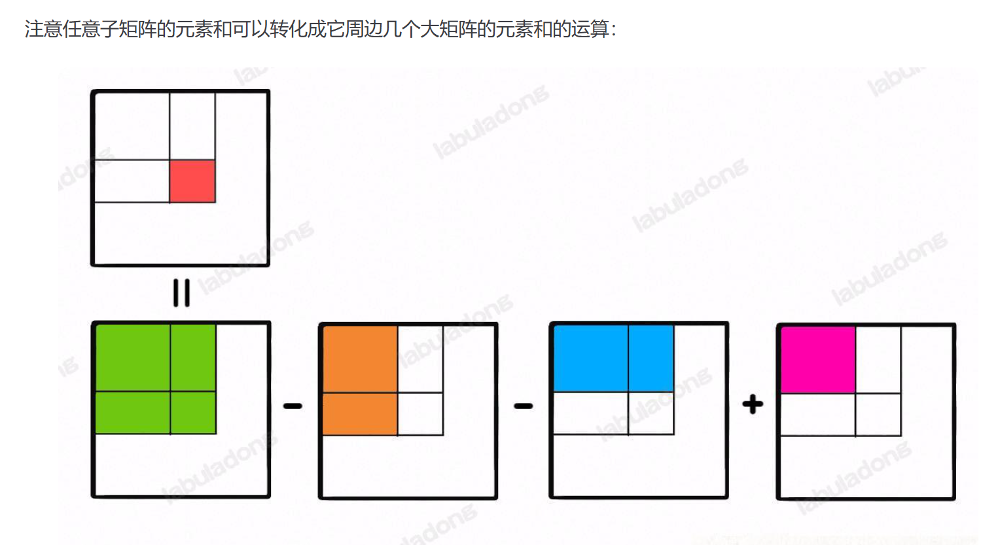

# 304. 二维区域和检索 - 矩阵不可变

**难度：中等**
**相关标签：数组、前缀和、设计**
**相关企业：**

---

## 题目描述

给定一个二维矩阵 `matrix`，处理以下类型的多个请求：

- 计算其子矩形范围内元素的总和，该子矩阵的左上角为 `(row1, col1)`，右下角为 `(row2, col2)`。

实现 `NumMatrix` 类：

- `NumMatrix(int[][] matrix)`：给定整数矩阵 `matrix` 进行初始化
- `int sumRegion(int row1, int col1, int row2, int col2)`：返回左上角 `(row1, col1)`、右下角 `(row2, col2)` 所描述的子矩阵的元素总和。

---

## 示例 1

**输入：**

```
["NumMatrix","sumRegion","sumRegion","sumRegion"]
[[[[3,0,1,4,2],[5,6,3,2,1],[1,2,0,1,5],[4,1,0,1,7],[1,0,3,0,5]]],[2,1,4,3],[1,1,2,2],[1,2,2,4]]
```

**输出：**

```
[null, 8, 11, 12]
```

**解释：**

```java
NumMatrix numMatrix = new NumMatrix([[3,0,1,4,2],[5,6,3,2,1],[1,2,0,1,5],[4,1,0,1,7],[1,0,3,0,5]]);
numMatrix.sumRegion(2, 1, 4, 3); // 返回 8（红色矩形框的元素总和）
numMatrix.sumRegion(1, 1, 2, 2); // 返回 11（绿色矩形框的元素总和）
numMatrix.sumRegion(1, 2, 2, 4); // 返回 12（蓝色矩形框的元素总和）
```

---

## 提示

- `m == matrix.length`
- `n == matrix[i].length`
- `1 <= m, n <= 200`
- `-10^5 <= matrix[i][j] <= 10^5`
- `0 <= row1 <= row2 < m`
- `0 <= col1 <= col2 < n`
- 最多调用 `10^4` 次 `sumRegion` 方法

## 解题思路

- 与303相同本质都是前缀和，不过这个变成了二维
- 通过构建二维前缀和数组，省去重复for循环遍历原矩阵元素求和

## 实现要点

- 一维前缀和数组`preSum[0] = 0`为了优化边界条件，二维的也同理。
- `preSum[i][j] = preSum[i - 1][j] + preSum[i][j - 1] - preSum[i - 1][j - 1] + matrix[i - 1][j - 1]`
- `row1, col1, row2, col2`区域的元素和，如下图所示：
- 注意前缀和数组与原矩阵的下标关系（因为前缀和数组左上角比矩阵多一圈0）
